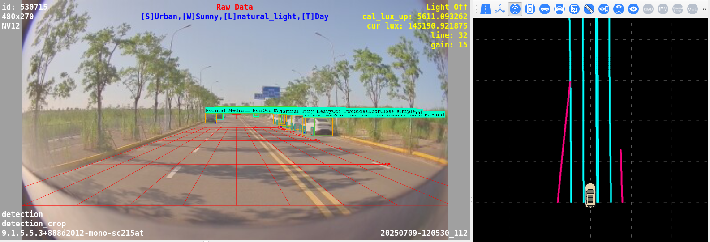

<h4 align="center">
💫 About Me:
</h4>

🎓 MSc in Artificial Intelligence from Sadjad University of Technology — focused on robotics, vision & perception.  
💼 Algorithm Engineer @ **Software‑Motion Inc.** — integrating advanced SLAM, calibration, and perception algorithms.  
🤖 Skilled in 3D vision, LiDAR-camera calibration, visual-inertial SLAM, and ROS development.  
🌍 Open to new opportunities across Europe in AI, robotics, or autonomous vehicle perception.  
📫 Contact: **behzad.onlive@gmail.com**  
🍢 Fun fact: I’m a kebab connoisseur 🍖

<h4 align="center">
🌐 Connect with me:
</h4>

  
  

<h4 align="center">
📜 Certifications:
</h4>

- ✅ Deep Learning Specialization – **deeplearning.ai**  
- ✅ TensorFlow Developer Certificate – **DeepLearning.AI**  
- ✅ AI For Everyone – **Coursera**  
- ✅ Introduction to Self-Driving Cars – **University of Toronto**  
- ✅ Autonomous Robots – **Columbia University**  
- ✅ Programming for Everyone (Python) – **University of Michigan**  

<h4 align="center">
💻 Technologies & Tools:
</h4>

  
  
  
  
  
  
  
  
  
  
  
  
  

